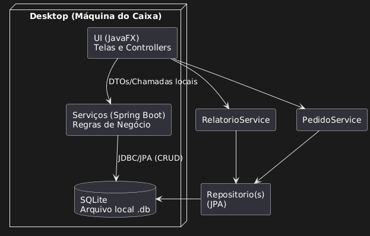
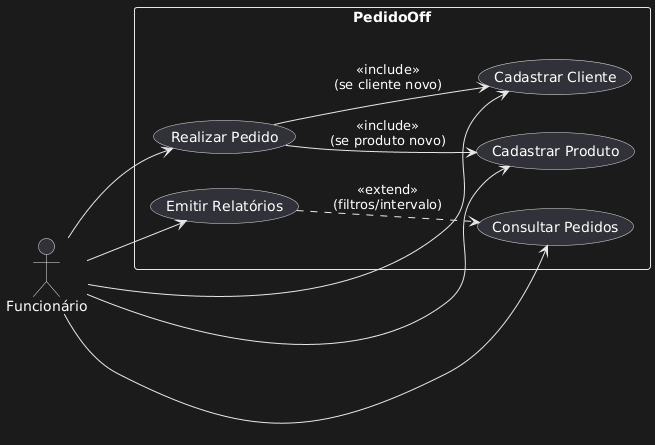
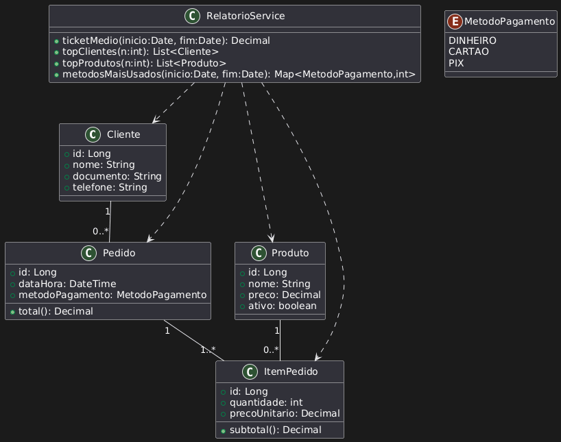
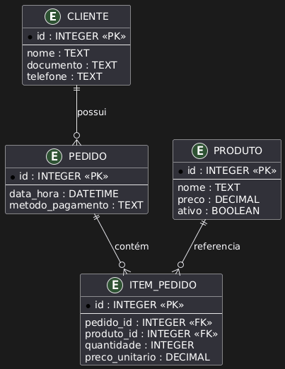
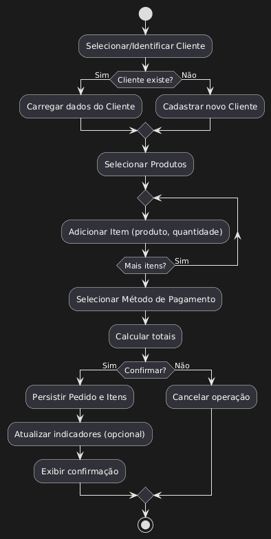
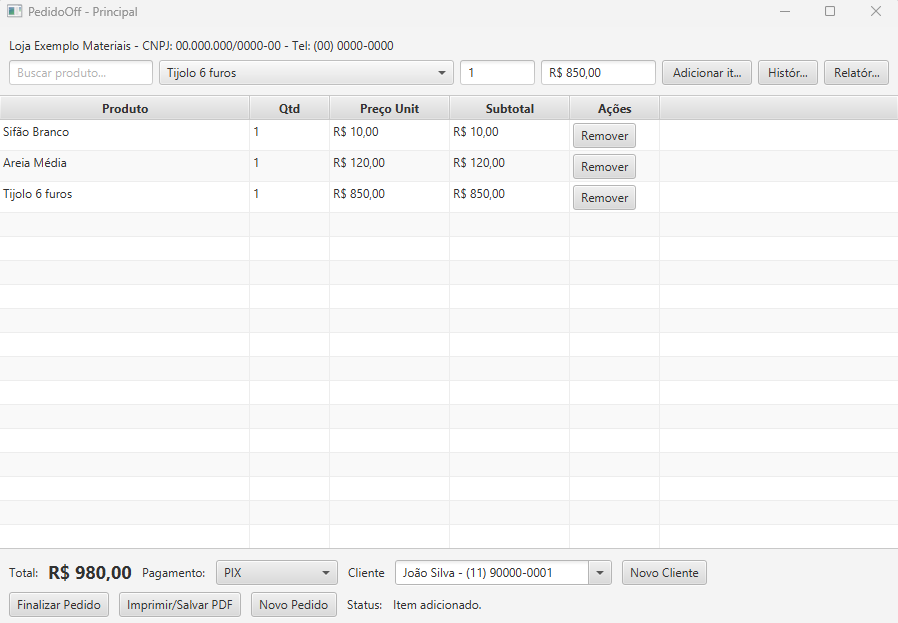
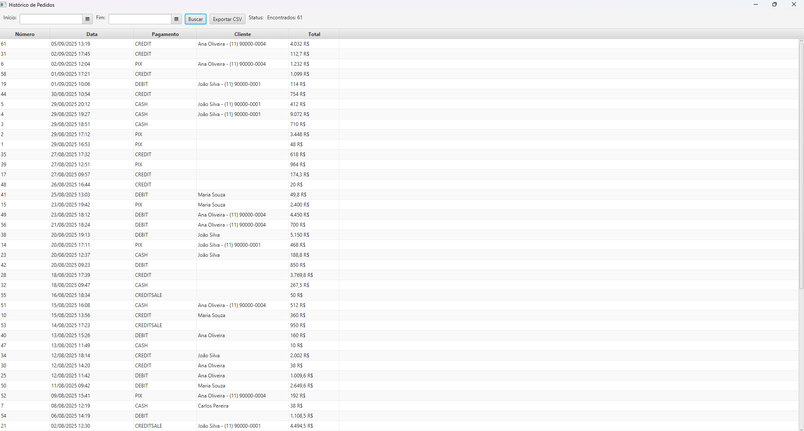
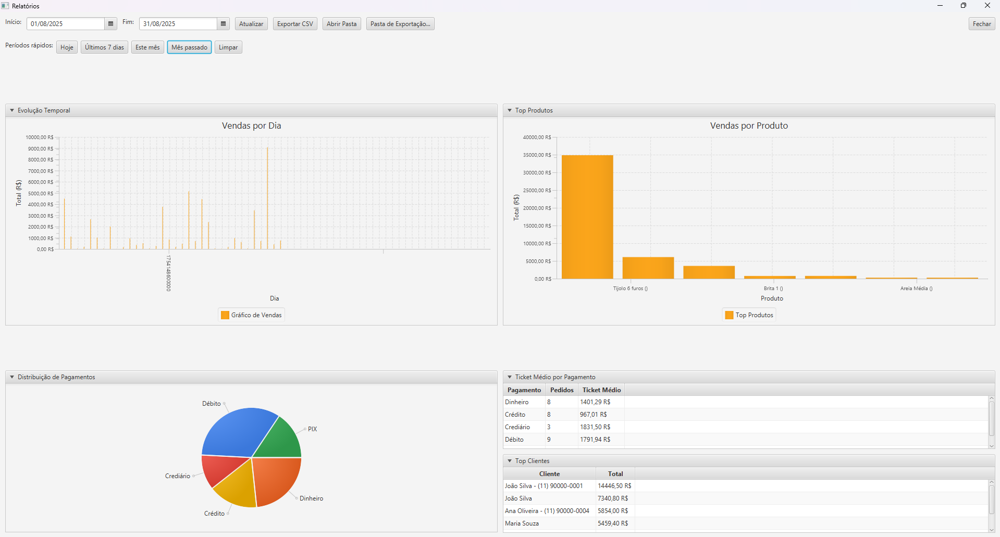

# PedidoOff – Sistema de Gestão de Pedidos Offline

O **PedidoOff** é uma aplicação desktop desenvolvida em **JavaFX** e **Spring Boot** para registrar e gerenciar **pedidos de forma offline**.  
Ele nasceu de um problema real: quando o sistema principal da loja fica indisponível e os pedidos passam a ser anotados no papel, gerando erros e retrabalho.  
Este repositório contém o código-fonte, instruções de execução, capturas de tela e **UML** do projeto.

> Projeto desenvolvido como parte do **Projeto Integrado** do curso de ADS, integrando Engenharia de Software e Arquitetura de Sistemas.

---

## 📚 Sumário
- [Funcionalidades](#-funcionalidades)
- [Tecnologias](#-tecnologias)
- [Arquitetura (Visão Geral)](#-arquitetura-visão-geral)
- [Modelagem UML](#-modelagem-uml)
- [Capturas de Tela](#-capturas-de-tela)
- [Como Executar](#-como-executar)
- [Testes & Cobertura](#-testes--cobertura)
- [Estrutura do Projeto](#-estrutura-do-projeto)
- [Futuras Melhorias](#-futuras-melhorias)
- [Autor](#-autor)

---

## ✅ Funcionalidades
- **Registro de Pedidos**: inclusão de produtos, quantidades e dados do cliente.
- **Histórico de Pedidos**: consulta e acompanhamento dos pedidos realizados.
- **Relatórios de Vendas**:
  - Ticket médio
  - Produtos mais vendidos
  - Métodos de pagamento mais utilizados
  - Clientes mais frequentes
- **Exportação de Dados**: exportação dos pedidos para **CSV**.
- **Testes Automatizados**: ~**80%** de cobertura com **JUnit 5** e **Mockito**.

---

## 🛠 Tecnologias
- **JavaFX** → interface gráfica.
- **Spring Boot** → backend e regras de negócio.
- **SQLite** → banco de dados leve e portátil.
- **Maven** → gerenciamento de dependências.
- **JUnit 5** & **Mockito** → testes unitários.
- **JaCoCo** → cobertura de código.

---

## 🧭 Arquitetura (Visão Geral)
Arquitetura em **camadas/MVC** para separar responsabilidades:
- UI (**JavaFX**)
- Serviços/Regras de Negócio (**Spring Boot**)
- Repositórios/Persistência (**JPA/SQLite**)

> Diagrama de Arquitetura  


---

## 📐 Modelagem UML
> Coloque os arquivos de imagem em **`docs/uml/`** com os nomes abaixo para que os links funcionem.

- **Casos de Uso**  
  

- **Diagrama de Classes**  
  

- **Entidade-Relacionamento (E-R)**  
  

- **Fluxo: Realizar Pedido (Atividades)**  
  

---

## 📷 Capturas de Tela
> Coloque as imagens em **`docs/screens/`** com os nomes abaixo.

- **Tela de Realização de Pedido**  
  

- **Histórico de Pedidos**  
  

- **Tela de Relatórios**  
  

---

## ▶️ Como Executar

### Pré-requisitos
- **JDK 11+**
- **Apache Maven 3.6+**

### Clonar & Compilar
```bash
git clone https://github.com/seu-usuario/pedido-offline.git
cd pedido-offline
mvn clean install
```

### Executar
```bash
java -jar target/pedido-offline-1.0-SNAPSHOT.jar
```
> Dica: se preferir executar via IDE, rode a classe principal (ex.: `App.java`).

### Problemas comuns
- **JavaFX não inicia**: verifique se as dependências do JavaFX estão no `pom.xml` e se a versão do JDK é compatível (11+).

---

## 🧪 Testes & Cobertura
Executar testes:
```bash
mvn test
```

Gerar relatório de cobertura com **JaCoCo**:
```bash
mvn test jacoco:report
```
Abra `target/site/jacoco/index.html` no navegador.

---

## 🗂 Estrutura do Projeto
> Exemplo simplificado (pode variar conforme seu repositório):
```
pedido-offline/
├─ docs/
│  ├─ screens/
│  │  ├─ pedido.png
│  │  ├─ historico.png
│  │  └─ relatorios.png
│  └─ uml/
│     ├─ arquitetura.png
│     ├─ casos-uso.png
│     ├─ classes.png
│     ├─ er.png
│     └─ fluxo-pedido.png
├─ src/
│  ├─ main/java/...  # código da aplicação
│  └─ test/java/...  # testes unitários
├─ pom.xml
└─ README.md
```

---

## 🚧 Futuras Melhorias
- **Geração de PDF** do pedido (botão já disponível na interface).
- Dashboards mais completos.
- Evolução para versão web e, futuramente, mobile.

---

## 👤 Autor
**Marcelo Henrique Pacobello**  
- LinkedIn: https://www.linkedin.com/in/marcelo-henrique-pacobello/  
- GitHub: https://github.com/CeloHelp
